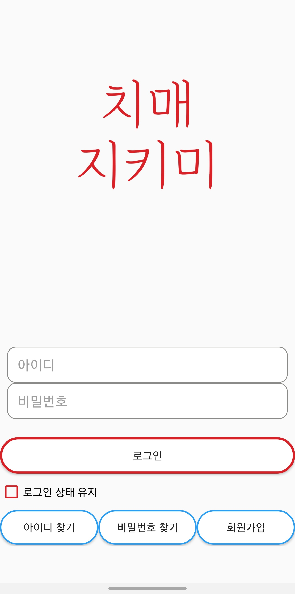
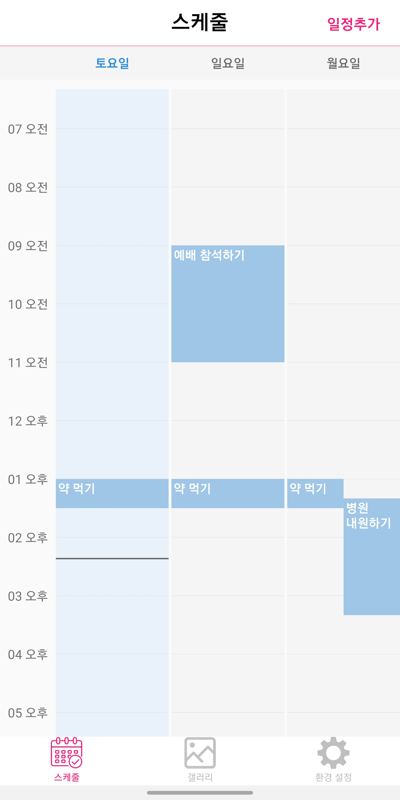

# KNUSD-20202-2
# 치매 기억 저장소 (안드로이드 어플리케이션)
## 프로젝트 목적 및 필요성
중앙치매센터의 ‘2019년 치매현황자료’에 의하면 65세 이상 인구 중 치매 환자는 2018년말 기준 75만 488명, 65세 이상 인구 중 치매유병율은 10.16%로 추정됩니다. 그리고 아직까지 알츠하이머 병을 고칠 수 있는 뚜렷한 치료제는 없습니다. 저희 조는 적지 않은 치매 환자들을 돕고 싶은 마음으로 프로젝트 주제를 결정했습니다.
플레이 스토어 조사 결과, 치매 자가진단 어플은 많지만 이미 치매를 겪는 사람들의 생활을 도와주는 어플은 미흡하거나 없었습니다. 이를 실현하기 위해 기억력 장애를 겪는 사용자를 보조하는 어플을 만들고자 했습니다.

## 기대효과 및 활용방안
보호자가 환자의 약 먹을 시간/가스 불 끄기 등 중요한 일을 스케줄링해서 기억력 장애를 겪는 환자의 생활을 도울 수 있습니다. 물건의 위치나 중요한 장소를 잊어버리는 환자를 위해 환자가 직접 또는 보호자가 해당 사진을 찍어 공유합니다. 치매 환자의 생활을 도움으로써 사소한 불편들을 해소하고 궁극적으로 치매 환자들의 삶의 질을 향상시키는 것이 목표입니다.

## 실행 화면
{: width="30%" height="30%"}
{: width="30%" height="30%"}
{: width="30%" height="30%"}

## 요구사항
안드로이드 9.0 이상

## 상세 내용
docs 내 문서 참조

# 사용된 라이브러리 또는 코드
### Gmail Sender
https://code.google.com/archive/p/javamail-android/downloads
### Revolving Week View
https://github.com/jlurena/revolvingweekview